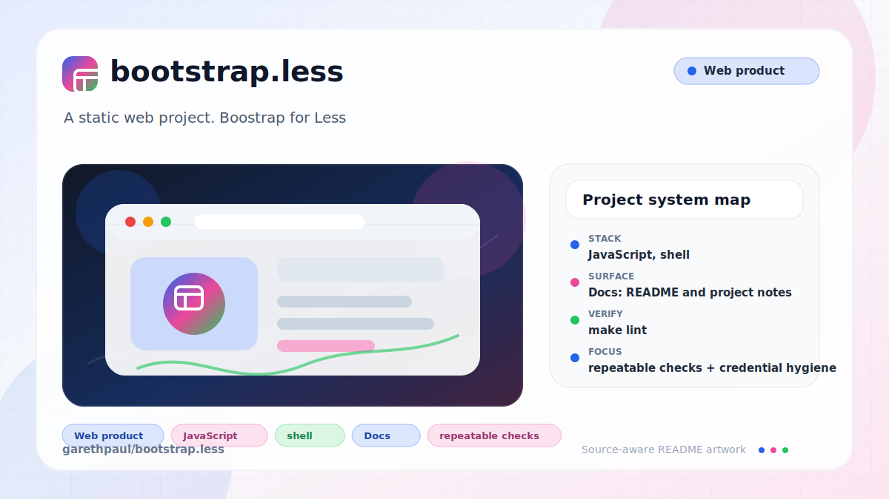

# bootstrap.less

<!-- README-OVERVIEW-IMAGE -->


## Overview

`garethpaul/bootstrap.less` is a static web project. Boostrap for Less

This README is based on the checked-in source, manifests, scripts, and repository metadata on the `master` branch. The project language mix found during review was: JavaScript (1), shell (1).

## Repository Contents

- `README.md` - project overview and local usage notes
- `docs` - source or example code
- `scripts` - source or example code
- `SECURITY.md` - security reporting and disclosure guidance
- `VISION.md` - project direction and maintenance guardrails

Additional scan context:

- Source directories: docs, scripts
- Dependency and build manifests: none detected
- Entry points or build surfaces: none detected
- Test-looking files: no obvious test files detected

## Getting Started

### Prerequisites

- Git

### Setup

```bash
git clone https://github.com/garethpaul/bootstrap.less.git
cd bootstrap.less
```

The setup commands above are derived from repository files. Legacy mobile, Python, or JavaScript samples may require older SDKs or package versions than a modern workstation uses by default.

## Running or Using the Project

Open `index.html` in a browser, or serve this directory with any static file server. The demo compiles `style.less` in the browser with the checked-in `less-1.1.3.min.js` runtime.

## Testing and Verification

Run the SDK-free source baseline and root wrapper gates:

```sh
make lint
make test
make build
make check
scripts/check-baseline.sh
```

GitHub Actions runs `make check` through `.github/workflows/check.yml` on
pushes, pull requests, and manual dispatches. The workflow uses a
commit-pinned checkout action, read-only repository access, and a bounded
runtime.
CodeQL analyzes the GitHub Actions and checked-in JavaScript surfaces with
pinned, credential-free, no-build jobs on pushes, pull requests, schedules,
and manual dispatches.

This repository has no package manager and no build pipeline. The root `make build` target preserves the static preflight and reports that `index.html` is the runnable artifact. The source check verifies the local LESS runtime, the `style.less` import of `bootstrap.less`, HTTPS page URLs, safe `target="_blank"` links, the document-wide no-referrer policy, keyboard skip navigation to a main landmark, visible link focus states, and user-triggered Twitter sharing with no automatic third-party script requests.

When the required SDK or runtime is unavailable, use static checks and source review first, then verify on a machine that has the matching platform toolchain.

## Configuration and Secrets

- Detected references to Twitter. Keep API keys, OAuth credentials, tokens, and account-specific values in local configuration only.

## Security and Privacy Notes

- Review changes touching external API calls or credential-adjacent configuration; examples from the scan include index.html.
- Review changes touching network requests, sockets, or service endpoints; examples from the scan include bootstrap.less, index.html, less-1.1.3.min.js.
- Review changes touching file, media, JSON, XML, CSV, OCR, or data parsing; examples from the scan include bootstrap.less, index.html, less-1.1.3.min.js.
- Review changes touching shell execution, subprocess, or dynamic evaluation; examples from the scan include less-1.1.3.min.js.
- Review changes touching database, model, or persistence code; examples from the scan include bootstrap.less.

## Maintenance Notes

- The opacity mixin uses its declared parameter for all generated opacity rules.
- Twitter sharing uses self-contained Web Intent links, so loading the page does
  not contact the Twitter widgets runtime.
- The page sets a document-wide no-referrer policy before loading styles,
  scripts, or outbound links.
- The page includes a mobile viewport meta tag so static local viewing starts
  from the device width instead of a desktop layout default.
- Twitter share links also use a no-referrer policy, isolated new tabs, encoded
  query parameters, and descriptive link text before handing off to the
  external share endpoint.
- The page bounds its historical 640px layout and stacks the overview grid on
  narrow screens so headings, links, and columns remain visible.
- Mailto query strings stay URL-encoded so static links remain valid.
- The visible button snippet uses its declared border radius parameter, matching
  the checked-in `.button()` mixin.
- The long reference page starts with a keyboard-accessible skip link targeting
  its single focusable `main` landmark, and links keep a visible focus outline.
- Root `make lint`, `make test`, `make build`, and `make check` keep the static
  source baseline available without introducing a package manager, including
  when invoked outside the repository root with `make -f`.
- See `SECURITY.md` for vulnerability reporting and safe research guidance.
- See `docs/plans/2026-06-09-static-make-gate-targets.md` for the root gate
  target baseline.
- See `docs/plans/2026-06-09-static-mailto-query-encoding.md` for the mailto
  link encoding guard.
- See `docs/plans/2026-06-09-static-button-sample-radius-parameter.md` for the
  button snippet radius parameter guard.
- See `docs/plans/2026-06-09-static-document-referrer-policy.md` for the
  page-level referrer policy guard.
- See `docs/plans/2026-06-09-static-viewport-meta-baseline.md` for the mobile
  viewport meta baseline.
- See `docs/plans/2026-06-10-ci-baseline.md` for the GitHub Actions baseline.
- See `docs/plans/2026-06-10-static-twitter-intent-links.md` for the
  user-triggered share-link and third-party script removal.
- See `VISION.md` for project direction and contribution guardrails.
- See `CHANGES.md` for the maintenance history.

## Contributing

Keep changes small and tied to the project that is already present in this repository. For code changes, document the toolchain used, avoid committing generated dependency directories or local configuration, and update this README when setup or verification steps change.
